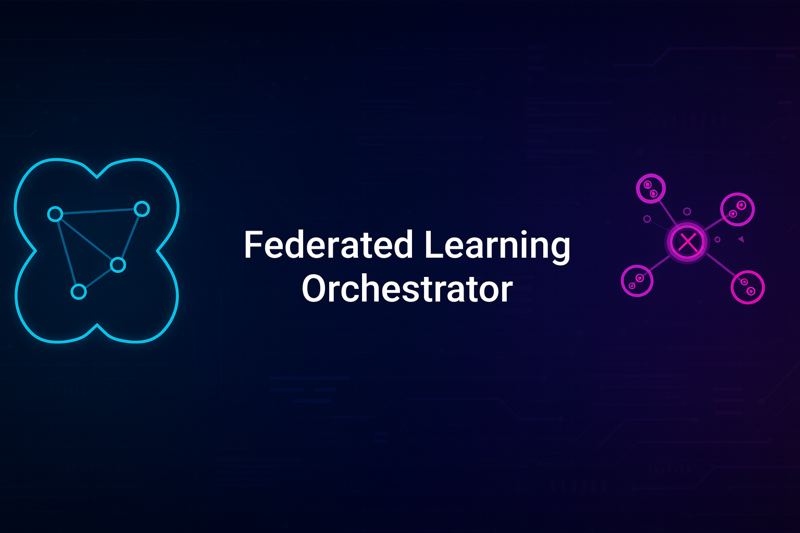

<p align="center">
  
</p>

**🔗 Privacy-Preserving Federated Learning for Mobile Devices**

*Coordinate distributed AI training across devices without centralized data sharing*

</div>

---

## 🚀 What It Does

- **🔗 Multi-Device Coordination** - Orchestrates federated learning across mobile devices
- **🔒 Differential Privacy** - Protects individual data with mathematical privacy guarantees
- **📱 Mobile-First Architecture** - Lightweight coordination optimized for Android devices
- **🛡️ Cryptographic Security** - HMAC signatures and privacy budget management

## ⚡ Quick Start

```bash
# Install NumPy (only external dependency)
pip install numpy

# Run the federated learning demo
python federated_learning_mvp.py
```

## 🎯 Key Features

| Feature | Description |
|---------|-------------|
| **Node Coordination** | Manages federated participants and coordinators |
| **Privacy Engine** | Differential privacy with budget allocation |
| **Model Aggregation** | Federated averaging with Byzantine fault tolerance |
| **Mobile Optimization** | Efficient SQLite storage and lightweight crypto |

## 🏗️ Architecture

```
FederatedLearningSystem
├── Coordinator (Round management, participant selection)
├── Privacy Engine (Differential privacy, budget tracking)  
├── Model Aggregator (Federated averaging, secure aggregation)
├── Participants (Local training, privacy-preserving updates)
└── Cryptographic Utils (HMAC signatures, noise injection)
```

## 📊 Demo Results

```bash
=== Federated Learning Orchestrator MVP Demo ===

1. Initializing Federated Learning Coordinator...
✓ Coordinator initialized with ID: a1b2c3d4

2. Adding Federated Participants...
✓ Added 5 participants with mobile optimization

--- Round 1 ---
✓ Round 1 completed successfully
Privacy Budget Status:
   node_a1b2: 9.00/10.00 remaining
   node_c3d4: 9.00/10.00 remaining

Final Results:
   Successful Rounds: 3/3
   Total Model Updates: 15
   Privacy Budget Management: ✓ Active
```

## 🎯 Use Cases

- **Healthcare AI** - Train medical models across hospitals without sharing patient data
- **Financial Services** - Fraud detection models without exposing transaction data
- **IoT Networks** - Edge AI learning across distributed sensors
- **Mobile Apps** - Personalized models without centralized user data

## 🛡️ Privacy & Security

- **🔒 Differential Privacy** - Mathematical privacy guarantees with epsilon-delta framework
- **📊 Privacy Budgets** - Automatic budget allocation and exhaustion prevention
- **🔐 Cryptographic Signatures** - HMAC-based model update verification
- **📱 Local Processing** - No raw data leaves participant devices

## 🔧 Enterprise Features

| Feature | Benefit |
|---------|---------|
| **GDPR Compliance** | Differential privacy meets regulatory requirements |
| **Byzantine Fault Tolerance** | Robust against malicious participants |
| **Reputation System** | Tracks participant reliability and contribution |
| **Privacy Budget Management** | Prevents privacy leakage over time |

## 📱 Requirements

```
Python 3.7+
NumPy (pip install numpy)
SQLite3 (included with Python)
```

**Tested Environments:**
- Samsung Galaxy S24 with Pydroid 3
- Mobile-optimized with WAL mode SQLite
- Efficient memory usage for resource-constrained devices

## 📁 Files

- `federated_learning_mvp.py` - Complete federated learning system
- `README.md` - Full technical documentation
- `LICENSE` - MIT License

## 🧪 Testing

The system includes comprehensive testing:
- ✅ Multi-round federated learning simulation
- ✅ Privacy budget exhaustion testing
- ✅ Cryptographic function validation
- ✅ Mobile performance benchmarks

## 🚀 Advanced Capabilities

- **Adaptive Privacy Budgets** - Dynamic epsilon allocation based on data sensitivity
- **Mobile Edge Deployment** - Optimized for IoT and mobile device constraints
- **Consensus Mechanisms** - Participant selection and result validation
- **Real-time Monitoring** - Federation health and privacy budget tracking

<h2>👤 About the Author</h2>
  <p><strong>Justin Lane</strong><br/>
  🔗 GitHub: <a href="https://github.com/aiwithjusl" target="_blank">@aiwithjusl</a><br/>
  🔗 LinkedIn: <a href="https://www.linkedin.com/in/justin-lane-69b960219" target="_blank">Justin Lane</a><br/>
  📬 Email: <a href="mailto:aiwithjusl.dev@gmail.com">aiwithjusl.dev@gmail.com</a></p>
  
---

<div align="center">

**⭐ Star this repo if you find it useful! ⭐**

*Built for enterprise AI deployment and privacy-compliant distributed learning.*

</div>
