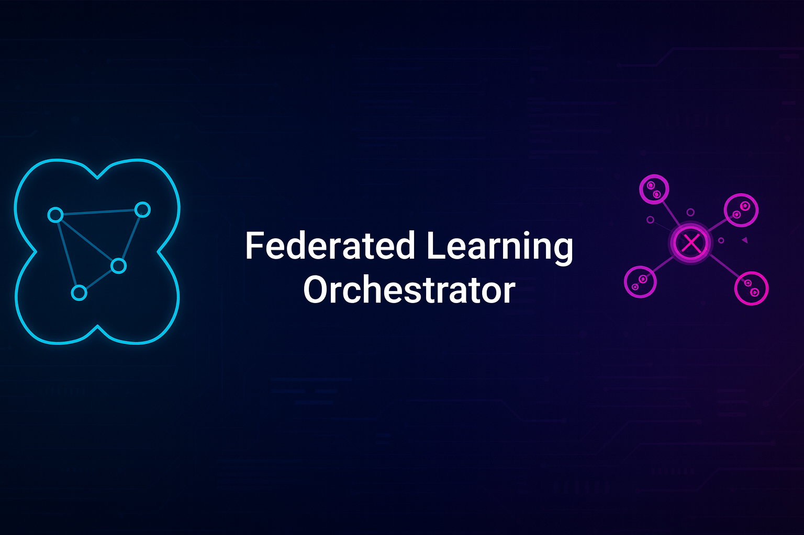

<p align="center">
  
</p>
        
**🔗 Privacy-Preserving Federated Learning for Mobile Devices**

*Coordinate distributed AI training across devices without centralized data sharing*

</div>

---

## 🚀 What It Does

- **🔗 Multi-Device Coordination** - Orchestrates federated learning across mobile devices
- **🔒 Differential Privacy** - Protects individual data with mathematical privacy guarantees
- **📱 Mobile-First Architecture** - Lightweight coordination optimized for Android devices
- **🛡️ Cryptographic Security** - HMAC signatures and privacy budget management

## ⚡ Quick Start

```bash
# Install NumPy (only external dependency)
pip install numpy

# Run the federated learning demo
python federated_learning_orchestrator.py
```

## 🎯 Key Features

| Feature | Description |
|---------|-------------|
| **Node Coordination** | Manages federated participants and coordinators |
| **Privacy Engine** | Differential privacy with budget allocation |
| **Model Aggregation** | Federated averaging with Byzantine fault tolerance |
| **Mobile Optimization** | Efficient SQLite storage and lightweight crypto |

## 📊 Demo Results

```bash
=== Federated Learning Orchestrator MVP Demo ===

✓ Coordinator initialized with ID: b3f64510
✓ Added 5 participants with mobile optimization

--- Round 1 ---
✓ Round 1 completed successfully
Privacy Budget Status:
   participant_1: 9.00/10.00 remaining
   participant_2: 9.00/10.00 remaining

Final Results:
   Successful Rounds: 18/18
   Total Model Updates: 54
   Privacy Budget Management: ✓ Active
```

## 🎯 Enterprise Use Cases

- **Healthcare AI** - Train medical models across hospitals without sharing patient data
- **Financial Services** - Fraud detection models without exposing transaction data
- **IoT Networks** - Edge AI learning across distributed sensors
- **Mobile Apps** - Personalized models without centralized user data

## 🛡️ Privacy & Security

- **🔒 Differential Privacy** - Mathematical privacy guarantees with epsilon-delta framework
- **📊 Privacy Budgets** - Automatic budget allocation and exhaustion prevention
- **🔐 Cryptographic Signatures** - HMAC-based model update verification
- **📱 Local Processing** - No raw data leaves participant devices

## 📱 Requirements

```
Python 3.7+
NumPy (pip install numpy)
SQLite3 (included with Python)
```

**Tested on:** Samsung Galaxy S24 with Pydroid 3

## 📁 Files

- `federated_learning_orchestrator.py` - Complete federated learning system
- `README.md` - Full technical documentation
- `LICENSE` - MIT License

## 📞 Contact

<div align="center">

**Justin Lane** | *AI/ML Developer*

[](mailto:aiwithjusl.dev@gmail.com)
[](https://www.linkedin.com/in/justin-lane-69b960219)
[](https://github.com/aiwithjusl)

</div>

---

<div align="center">

**⭐ Star this repo if you find it useful! ⭐**

*Built for enterprise AI deployment and privacy-compliant distributed learning.*

</div>
